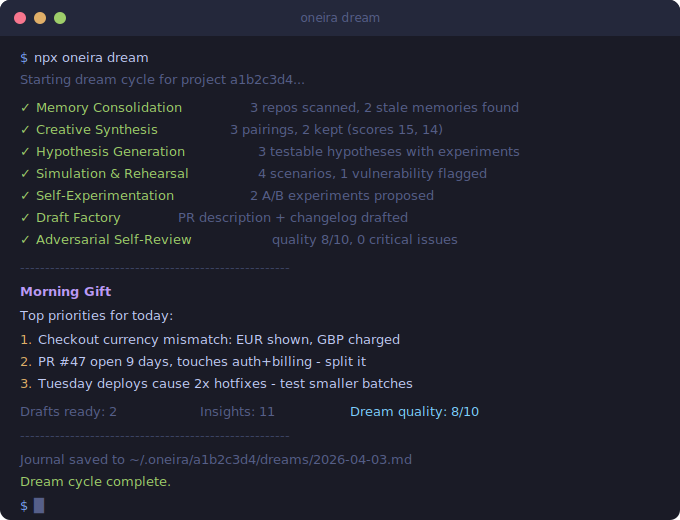

# oneira

**A CLI that gives your AI agent an overnight thinking cycle.**

Oneira runs a 7-phase dream over your repo while you sleep, then leaves you a morning brief with bugs worth fixing, hypotheses worth testing, and drafts worth shipping.

[](https://www.npmjs.com/package/oneira)
[](https://nodejs.org/)
[](https://github.com/Bambushu/oneira/blob/main/LICENSE)
[](https://github.com/Bambushu/oneira)

<p align="center">
  
</p>

Most agent tooling helps with memory. Oneira helps with reflection.

Instead of only summarizing what happened, it uses the quiet hours to:

- consolidate what changed
- make novel connections across your code and history
- generate hypotheses and lightweight experiments
- simulate failure modes before they happen
- draft useful artifacts for the next day
- red-team the highest-risk decisions

If you work in a repo every day, the output should feel less like a log and more like a sharp staff engineer's morning note.

## What You Wake Up To

```text
Morning Gift for 2026-04-03

Top 3 priorities
1. Checkout currency path is inconsistent: UI shows EUR, charge path still defaults to GBP.
   Why it matters: likely revenue-impacting and customer-visible.
   Next step: inspect checkout total formatter and payment intent creation side by side.

2. PR #47 has been open for 9 days and touches auth, billing, and middleware.
   Why it matters: broad diffs are stalling review and increasing merge risk.
   Next step: split the middleware extraction into a separate PR.

3. Hypothesis: Tuesday deploys create more hotfixes because they batch unrelated changes.
   Evidence: 6 of the last 8 hotfixes landed within 24h of Tuesday releases.
   Next step: compare hotfix rate for smaller midweek deploys over the next 2 weeks.

Drafts ready
- PR description for feat/auth-session-rotation
- Changelog entry for v0.4.0

Dream quality: 8.4/10
```

That is the bar. A developer should read it and know what to do next.

## Why It Exists

AI agents spend a lot of time idle between runs. Oneira turns that idle time into a scheduled cognition pass over the project.

```text
repo state + git history + prior journals + optional lucid prompt
                              |
                              v
                     [ oneira orchestrator ]
                              |
    +--------------+----------+----------+----------+----------+----------+----------+
    |              |                     |                     |                     |
    v              v                     v                     v                     v
consolidation  synthesis           hypothesis            simulation         experimentation
                                                                                 |
                                                                                 v
                                                                       drafts + self-review
                                                                                 |
                                                                                 v
                                                                          Morning Gift
```

Each phase is stateless and pure: context in, result out. The orchestrator handles storage, journaling, and recovery.

## Install

```bash
npm install -D oneira @anthropic-ai/sdk
export ANTHROPIC_API_KEY=your_key_here
```

Requirements:

- Node.js 18+
- a git repository
- an Anthropic API key

## Quick Start

```bash
npx oneira init
npx oneira dream
npx oneira schedule
```

`oneira init` creates `oneira.yaml` in your repo.

`oneira dream` runs the full overnight cycle immediately.

`oneira schedule` prints the cron command to run it every night.

## The 7 Phases

```text
1. Memory Consolidation   What changed? What is stale? What should be remembered?
2. Creative Synthesis     Which unrelated pieces now connect in a useful way?
3. Hypothesis Generation  What patterns might be true, and how would we test them?
4. Simulation             What breaks if traffic spikes, a dependency fails, or scope expands?
5. Self-Experimentation   Which prompts, configs, or workflows are worth A/B testing?
6. Draft Factory          What can be pre-written before the human opens the editor?
7. Self-Review            What is risky, weak, or misleading in the current plan?
```

Memory is only the first phase. The value comes from what happens after memory.

## Lucid Dreaming

You can point the whole cycle at a specific question:

```bash
npx oneira lucid "How can I reduce API latency without adding more infrastructure?"
npx oneira dream
```

That prompt is stored for the next dream, then cleared unless you set `lucid` in `oneira.yaml`.

## Commands

| Command | What it does |
| --- | --- |
| `npx oneira init` | Create `oneira.yaml` and validate the API key if present |
| `npx oneira dream` | Run the full dream cycle |
| `npx oneira dream --phases consolidation,review` | Run only selected phases |
| `npx oneira lucid "topic"` | Set the next dream's focus |
| `npx oneira lucid --clear` | Clear the current lucid prompt |
| `npx oneira journal` | Print the latest dream journal |
| `npx oneira journal 2026-04-03` | Print a specific journal by date |
| `npx oneira schedule` | Print scheduler setup instructions |

## Configuration

```yaml
provider: anthropic

phases:
  - consolidation
  - synthesis
  - hypothesis
  - simulation
  - experimentation
  - drafts
  - review

schedule:
  start: "22:00"
  end: "06:00"
  timezone: auto

lucid: null
```

Remove phases to disable them. Reorder phases if you want a different sequence.

## What Makes Oneira Different

This is not positioned as a better chatbot or a better memory layer. It is a scheduled cognition loop for repos.

| Capability | Typical agent memory tooling | Oneira |
| --- | --- | --- |
| Summarize and consolidate prior context | Yes | Yes |
| Generate new hypotheses from project history | Rarely | Yes |
| Simulate failure modes before the next work session | Rarely | Yes |
| Draft changelogs, PR text, or docs automatically | Sometimes | Yes |
| Run as a structured multi-phase overnight pipeline | Rarely | Yes |
| Focus an entire run around one question | Rarely | Yes |

If all you need is memory consolidation, Oneira is probably too much. If you want your agent to come back with ideas, drafts, and objections, this is the point.

## Programmatic API

```ts
import {
  BUILTIN_PHASES,
  createAdapter,
  FileStorage,
  loadConfig,
  Orchestrator,
  resolveProjectId,
} from 'oneira';

const projectId = resolveProjectId();
const config = loadConfig(process.cwd(), projectId);
const storage = new FileStorage(`~/.oneira/${projectId}`);
const llm = await createAdapter(config.provider);

const orchestrator = new Orchestrator({
  config,
  storage,
  llm,
  memory: storage.getMemoryStore(),
  phases: BUILTIN_PHASES,
});

await orchestrator.run();
```

## Storage and Resilience

- Each git repo gets its own namespace under `~/.oneira/{project-id}`
- Crash recovery resumes from the last completed phase
- Partial runs via `--phases` do not corrupt the nightly cycle
- Critical issues can surface immediately instead of waiting for the morning brief
- Sparse input returns "not enough data" instead of pretending certainty

## Contributing

Issues and pull requests are welcome. For local development:

```bash
npm install
npm test
```

## Links

- [npm package](https://www.npmjs.com/package/oneira)
- [License](https://github.com/Bambushu/oneira/blob/main/LICENSE)

## License

MIT
